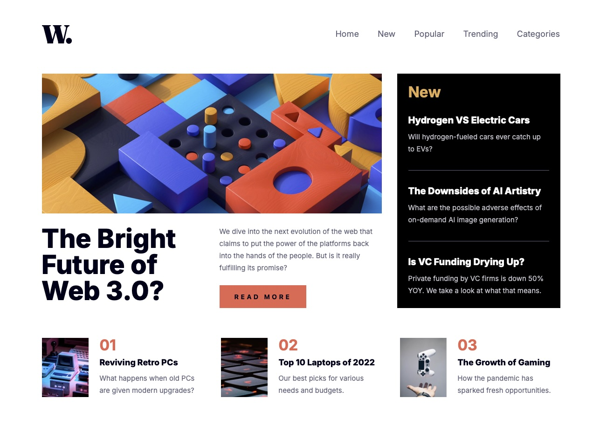

# Frontend Mentor - News homepage solution

This is a solution to the [News homepage challenge on Frontend Mentor](https://www.frontendmentor.io/challenges/news-homepage-H6SWTa1MFl). Frontend Mentor challenges help you improve your coding skills by building realistic projects.

## Table of contents

- [Overview](#overview)
  - [The challenge](#the-challenge)
  - [Screenshot](#screenshot)
  - [Links](#links)
- [My process](#my-process)
  - [Built with](#built-with)
  - [What I learned](#what-i-learned)
  - [Useful resources](#useful-resources)
- [Author](#author)

## Overview

### The challenge

Users should be able to:

- View the optimal layout for the interface depending on their device's screen size
- See hover and focus states for all interactive elements on the page

### Screenshot

### Links

- Solution URL: [Solution](https://github.com/vince4dev/challenge18)
- Live Site URL: [Live site](https://vince4dev.github.io/challenge18/)

## My process

### Built with

- Semantic HTML5 markup
- CSS custom properties
- Flexbox
- CSS Grid
- Mobile-first workflow
- Javascript

### What I learned

CSS Grid & Button Width

- In a display: grid container, children expand to fill the whole cell by default. To prevent the READ MORE button from stretching across the entire width, I set "justify-self: start;"

Focus Management (Accessibility)

- Created getFocusableElements() that returns only visible elements (offsetParent !== null).
- Implemented a focus‑trap (Tab / Shift+Tab handling) so keyboard navigation stays inside the mobile menu.
- Conditionally added or removed tabindex="-1" to disable elements when the menu is closed.

Mobile View Detection

- Used window.matchMedia('(max-width:1439px)') to detect mobile devices, enabling the focus‑trap and tabindex logic only when needed.

Overlay & Close Functionality

- Functionality Added an overlay that closes the menu on click, sharing the same handler as the “close” button.

ARIA State

- Updated aria-expanded on the menu toggle to reflect open/closed state, aiding assistive technologies.

Event Handling & Cleanup

- DOMContentLoaded for initial state.
- Resize to recalc mobile view.
- Added/removed keydown listener only when the menu is open, preventing unnecessary side‑effects.

Clean & Reusable Code

- Grouped constants (navMenu, navToggle, etc.) at the top.
- Utility functions (toggleTabIndex, setFocusableState) avoid duplicate logic.
- Clear comments and numbered sections for readability.

### Useful resources

- [google-webfonts-helper](https://gwfh.mranftl.com/fonts) - This helped me find the font and integrate it into the project.
- [MDN](https://developer.mozilla.org/fr/) - Resources for Developers.

## Author

- Frontend Mentor - [@vince4dev](https://www.frontendmentor.io/profile/vince4dev)
